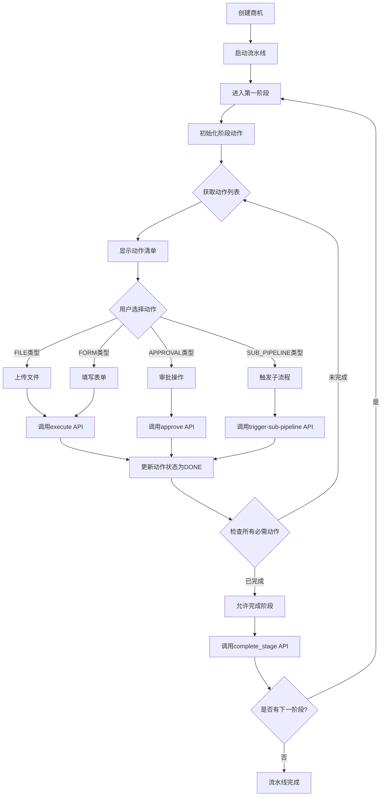
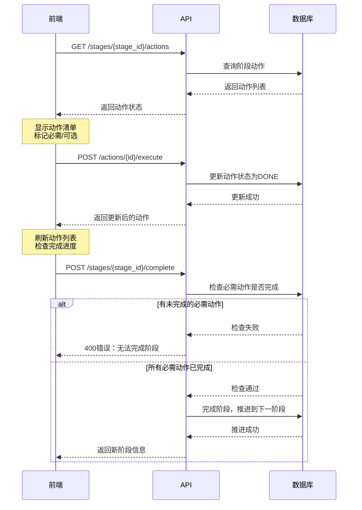

# 商机流水线动作系统 - 前端开发指南

## 快速概览

### 系统架构
```
商机 → 流水线 → 阶段 → 动作（新增）
```

### 5种动作类型
- **FILE** - 文件上传
- **FORM** - 表单填写
- **APPROVAL** - 审批操作
- **SUB_PIPELINE** - 触发子流程
- **API_CALL** - API调用

### 5种动作状态
- `TODO` - 待执行
- `PROCESSING` - 执行中
- `DONE` - 已完成
- `SKIPPED` - 已跳过
- `FAILED` - 失败

---

## API端点（7个）

**基础路径：** `/api/order-workflow/opportunities`

| 方法 | 路径 | 用途 |
|------|------|------|
| GET | `/{opp_id}/pipeline/stages/{stage_id}/actions` | 获取阶段动作列表 |
| POST | `/{opp_id}/pipeline/actions/{action_id}/execute` | 执行动作（FILE/FORM） |
| POST | `/{opp_id}/pipeline/actions/{action_id}/approve` | 审批动作 |
| POST | `/{opp_id}/pipeline/actions/{action_id}/skip` | 跳过动作 |
| GET | `/{opp_id}/pipeline/actions/{action_id}` | 获取动作详情 |
| GET | `/{opp_id}/pipeline/actions` | 获取商机所有动作 |
| POST | `/{opp_id}/pipeline/actions/{action_id}/trigger-sub-pipeline` | 触发子流水线 |

---

## 商机流转流程图



---

## 阶段动作执行流程



---

## 前端实现示例

### 1. 获取并显示阶段动作

```typescript
// 类型定义
interface Action {
  id: string;
  action_code: string;
  action_name: string;
  action_type: 'FILE' | 'FORM' | 'APPROVAL' | 'SUB_PIPELINE' | 'API_CALL';
  status: 'TODO' | 'PROCESSING' | 'DONE' | 'SKIPPED' | 'FAILED';
  operator_id?: string;
  finished_at?: string;
  captured_data?: any;
  notes?: string;
}

interface StageActions {
  stage_id: string;
  stage_name: string;
  actions: Action[];
  total_actions: number;
  completed_actions: number;
  required_actions: number;
  can_complete_stage: boolean;
}

// 获取阶段动作
async function getStageActions(opportunityId: string, stageId: string): Promise<StageActions> {
  const response = await fetch(
    `/api/order-workflow/opportunities/${opportunityId}/pipeline/stages/${stageId}/actions`,
    {
      headers: { 'Authorization': `Bearer ${token}` }
    }
  );
  const result = await response.json();
  return result.data;
}

// 显示动作列表
function renderActions(stageActions: StageActions) {
  return (
    <div>
      <h3>{stageActions.stage_name}</h3>
      <p>进度: {stageActions.completed_actions} / {stageActions.total_actions}</p>

      {stageActions.actions.map(action => (
        <ActionItem
          key={action.id}
          action={action}
          onComplete={() => refreshActions()}
        />
      ))}

      <button
        disabled={!stageActions.can_complete_stage}
        onClick={() => completeStage()}
      >
        完成阶段
      </button>
    </div>
  );
}
```

### 2. 执行文件上传动作

```typescript
async function executeFileAction(
  opportunityId: string,
  actionId: string,
  file: File
) {
  // 1. 先上传文件到文件服务器
  const formData = new FormData();
  formData.append('file', file);

  const uploadResponse = await fetch('/api/upload', {
    method: 'POST',
    body: formData
  });
  const { file_path } = await uploadResponse.json();

  // 2. 执行动作
  const response = await fetch(
    `/api/order-workflow/opportunities/${opportunityId}/pipeline/actions/${actionId}/execute`,
    {
      method: 'POST',
      headers: {
        'Authorization': `Bearer ${token}`,
        'Content-Type': 'application/json'
      },
      body: JSON.stringify({
        captured_data: {
          file_path: file_path,
          file_size: file.size,
          file_name: file.name,
          mime_type: file.type
        },
        notes: `已上传文件: ${file.name}`
      })
    }
  );

  return await response.json();
}
```

### 3. 执行审批动作

```typescript
async function approveAction(
  opportunityId: string,
  actionId: string,
  approved: boolean,
  notes: string,
  extraData?: any
) {
  const response = await fetch(
    `/api/order-workflow/opportunities/${opportunityId}/pipeline/actions/${actionId}/approve`,
    {
      method: 'POST',
      headers: {
        'Authorization': `Bearer ${token}`,
        'Content-Type': 'application/json'
      },
      body: JSON.stringify({
        approved: approved,
        approval_notes: notes,
        captured_data: extraData
      })
    }
  );

  return await response.json();
}

// 使用示例
<button onClick={() => approveAction(oppId, actionId, true, '审批通过')}>
  通过
</button>
<button onClick={() => approveAction(oppId, actionId, false, '需要补充材料')}>
  拒绝
</button>
```

### 4. 完成阶段

```typescript
async function completeStage(opportunityId: string, stageId: string) {
  const response = await fetch(
    `/api/order-workflow/opportunities/${opportunityId}/pipeline/stages/${stageId}/complete`,
    {
      method: 'POST',
      headers: {
        'Authorization': `Bearer ${token}`,
        'Content-Type': 'application/json'
      },
      body: JSON.stringify({
        notes: '阶段完成'
      })
    }
  );

  if (!response.ok) {
    const error = await response.json();
    alert(error.detail); // "阶段还有未完成的必需动作，无法完成阶段"
    return;
  }

  // 成功后刷新流水线状态
  await refreshPipelineProgress();
}
```

---

## UI设计建议

### 动作列表展示

```
┌─────────────────────────────────────────┐
│ 发票阶段                    进度: 1/2    │
├─────────────────────────────────────────┤
│ ✅ 上传开票抬头截图 (FILE)              │
│    已完成 - 2026-02-13 10:05           │
│    操作人: 张三                         │
│                                         │
│ ⏳ 财务税务合规核实 (APPROVAL) [必需]   │
│    [通过] [拒绝]                        │
│                                         │
├─────────────────────────────────────────┤
│ [完成阶段] (禁用 - 还有必需动作未完成)  │
└─────────────────────────────────────────┘
```

### 状态图标

- ✅ DONE - 绿色对勾
- ⏳ TODO - 灰色时钟
- 🔄 PROCESSING - 蓝色加载动画
- ⏭️ SKIPPED - 黄色跳过图标
- ❌ FAILED - 红色叉号

### 必需标记

- 必需动作显示 `[必需]` 标签
- 可选动作显示 `[可选]` 标签或不显示

---

## 关键业务规则

### 1. 必需动作约束
- 必需动作（is_required=true）必须完成才能完成阶段
- 必需动作不能跳过
- 前端应禁用"完成阶段"按钮，直到所有必需动作完成

### 2. 动作顺序
- 动作按 `order` 字段排序显示
- 建议按顺序执行，但不强制

### 3. 阶段完成检查
```typescript
// 检查是否可以完成阶段
function canCompleteStage(stageActions: StageActions): boolean {
  return stageActions.can_complete_stage;
}

// 或者手动检查
function manualCheck(actions: Action[]): boolean {
  const requiredActions = actions.filter(a => a.is_required);
  const completedRequired = requiredActions.filter(a => a.status === 'DONE');
  return requiredActions.length === completedRequired.length;
}
```

---

## 错误处理

```typescript
async function handleActionExecution(fn: () => Promise<any>) {
  try {
    const result = await fn();
    showSuccess('操作成功');
    return result;
  } catch (error) {
    if (error.status === 400) {
      showError(error.detail); // 业务错误
    } else if (error.status === 401) {
      redirectToLogin(); // 未授权
    } else {
      showError('操作失败，请稍后重试');
    }
  }
}
```

---

## 完整流程示例

```typescript
// 1. 商机进入某个阶段后
async function onStageEntered(opportunityId: string, stageId: string) {
  // 获取阶段动作
  const stageActions = await getStageActions(opportunityId, stageId);

  // 显示动作列表
  renderActions(stageActions);
}

// 2. 用户执行动作
async function onActionClick(action: Action) {
  if (action.action_type === 'FILE') {
    // 显示文件上传对话框
    const file = await showFileUploadDialog();
    await executeFileAction(opportunityId, action.id, file);
  } else if (action.action_type === 'APPROVAL') {
    // 显示审批对话框
    const { approved, notes } = await showApprovalDialog();
    await approveAction(opportunityId, action.id, approved, notes);
  }

  // 刷新动作列表
  await onStageEntered(opportunityId, stageId);
}

// 3. 用户完成阶段
async function onCompleteStageClick() {
  const stageActions = await getStageActions(opportunityId, stageId);

  if (!stageActions.can_complete_stage) {
    alert('还有必需动作未完成');
    return;
  }

  await completeStage(opportunityId, stageId);

  // 刷新流水线进度
  await refreshPipelineProgress();
}
```

---

## 测试场景

### 场景1：正常流程
1. 进入发票阶段
2. 上传开票抬头截图 → 状态变为DONE
3. 财务审批通过 → 状态变为DONE
4. 点击"完成阶段" → 成功，进入下一阶段

### 场景2：缺少必需动作
1. 进入发票阶段
2. 只上传开票抬头截图
3. 点击"完成阶段" → 失败，提示"还有未完成的必需动作"

### 场景3：跳过可选动作
1. 进入某阶段
2. 完成所有必需动作
3. 跳过可选动作
4. 点击"完成阶段" → 成功

---

## 常见问题

**Q: 如何判断动作是否必需？**
A: 通过 `is_required` 字段判断（需要从动作配置中获取）

**Q: 动作可以重复执行吗？**
A: 已完成的动作不能重复执行，会返回400错误

**Q: 如何撤销已完成的动作？**
A: 当前版本不支持撤销，需要联系管理员

**Q: 子流水线触发后如何跟踪？**
A: 通过 `captured_data` 中的子流水线信息跟踪

---

## 相关文档

- [商机流水线API文档](./API_DOCUMENTATION_OPPORTUNITY_PIPELINE.md)
- [实施总结](./PIPELINE_ACTIONS_IMPLEMENTATION.md)
