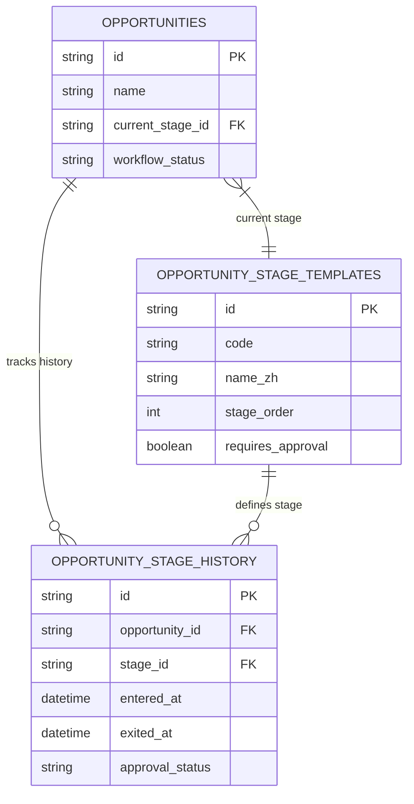

# 商机流水线与天眼查集成逻辑文档

本文档详细描述了商机单流程流水线（9阶段）的业务逻辑、数据库结构以及天眼查功能的集成方案。

## 1. 概述 (Overview)

系统采用单流程流水线设计，所有商机都遵循统一的 9 个固定阶段流转。这种设计简化了业务流程，确保了所有业务机会都经过标准化的处理步骤，从初步接触到最终收款闭环。

同时，系统集成了天眼查 API，用于在商机创建或客户管理阶段自动获取和填充企业工商信息，提高数据录入效率和准确性。

## 2. 数据库架构 (Database Architecture)

商机流水线的核心数据模型由以下三个表组成：

### 2.1 核心表结构

#### 1. 商机主表 (`opportunities`)
存储商机的基础信息和当前状态。

| 字段名 | 类型 | 说明 | 关键关联 |
| :--- | :--- | :--- | :--- |
| `id` | String(36) | 主键 (UUID) | |
| `stage` | String(50) | 阶段代码 (冗余) | |
| `status` | String(50) | 状态 (active, won, lost, cancelled) | |
| `current_stage_id` | String(36) | 当前阶段 ID | FK -> `opportunity_stage_templates.id` |
| `workflow_status` | String(50) | 工作流状态 | active(进行中), paused(暂停), completed(完成), cancelled(取消) |
| `customer_id` | Integer | 客户 ID | FK -> `customers.id` |
| `primary_quotation_id` | String(36) | 主报价单 ID | FK -> `quotations.id` |
| `primary_contract_id` | String(36) | 主合同 ID | FK -> `contracts.id` |

#### 2. 商机阶段模板表 (`opportunity_stage_templates`)
定义标准的 9 个阶段配置。

| 字段名 | 类型 | 说明 | 关键数据 |
| :--- | :--- | :--- | :--- |
| `id` | String(36) | 主键 (UUID) | |
| `code` | String(50) | 阶段代码 (唯一) | new, service_plan, quotation... |
| `name_zh` | String(255) | 中文名称 | 新建, 服务方案, 报价单... |
| `stage_order` | Integer | 阶段顺序 | 1-9 |
| `requires_approval` | Boolean | 是否需要审批 | |
| `approval_roles_json` | JSON | 审批角色列表 | ["sales_manager", "finance"] |
| `conditions_json` | JSON | 准入/准出条件 | |

#### 3. 商机阶段历史表 (`opportunity_stage_history`)
记录商机在各个阶段的流转历史和审批记录。

| 字段名 | 类型 | 说明 | 关键关联 |
| :--- | :--- | :--- | :--- |
| `id` | String(36) | 主键 (UUID) | |
| `opportunity_id` | String(36) | 商机 ID | FK -> `opportunities.id` |
| `stage_id` | String(36) | 阶段 ID | FK -> `opportunity_stage_templates.id` |
| `entered_at` | DateTime | 进入时间 | |
| `exited_at` | DateTime | 退出时间 | NULL 表示当前阶段 |
| `duration_days` | Integer | 停留天数 | 计算字段 |
| `approval_status` | String(50) | 审批状态 | pending, approved, rejected |
| `approved_by` | String(36) | 审批人 ID | FK -> `users.id` |

### 2.2 实体关系图 (ER Diagram)

## 3. 工作流逻辑 (Workflow Logic)

### 3.1 标准 9 阶段流程

系统预定义了严格的线性流程，商机必须按照 `stage_order` 顺序流转（特殊情况除外）。

1.  **新建 (new)**
    *   **order**: 1
    *   **描述**: 商机初始创建阶段。
    *   **动作**: 完善商机基本信息，确认客户需求。

2.  **服务方案 (service_plan)**
    *   **order**: 2
    *   **描述**: 为客户制定具体的服务方案。
    *   **动作**: 关联产品，确认服务内容。

3.  **报价单 (quotation)**
    *   **order**: 3
    *   **描述**: 生成并发送报价单。
    *   **动作**: 创建报价单，发送给客户，等待客户确认。
    *   **依赖**: 需先完成服务方案。

4.  **合同 (contract)**
    *   **order**: 4
    *   **描述**: 签署正式合同。
    *   **动作**: 生成合同，双方签署，上传合同文件。
    *   **依赖**: 客户需接受报价单。

5.  **发票 (invoice)**
    *   **order**: 5
    *   **描述**: 开具发票。
    *   **动作**: 根据合同条款生成发票，发送给客户。

6.  **办理资料 (handling_materials)**
    *   **order**: 6
    *   **描述**: 收集业务办理所需资料。
    *   **动作**: 根据产品规则收集客户资料（支持 ZIP/PDF 等），校验资料完整性。
    *   **特性**: 资料清单由关联产品的 `product_document_rules` 动态生成。

7.  **回款状态 (collection_status)**
    *   **order**: 7
    *   **描述**: 确认款项到账情况。
    *   **动作**: 财务核对银行流水，确认回款。

8.  **分配执行 (assign_execution)**
    *   **order**: 8
    *   **描述**: 将任务分配给执行团队。
    *   **动作**: 创建执行订单 (`execution_orders`)，指派给具体的执行人员或团队。

9.  **收款 (collection)**
    *   **order**: 9
    *   **描述**: 最终财务结算与确认。
    *   **动作**: 尾款确认（如有），整体财务闭环。

### 3.2 阶段流转规则

*   **顺序流转**: 通常通过 `OpportunityStageTemplateRepository.get_next_stage(current_order)` 获取下一阶段。
*   **前置条件检查**: 在进入下一阶段前，系统会检查 `conditions_json` 定义的条件（如：必须有主报价单才能进入合同阶段）。
*   **审批机制**: 如果目标阶段 `requires_approval = true`，商机会进入 `approval_status = pending` 状态，需有权限用户审批通过后才算正式进入该阶段。
*   **历史记录**: 每次阶段变更（包括审批），都会在 `opportunity_stage_history` 表中插入一条新记录，并更新上一条记录的 `exited_at`。

## 4. 天眼查集成 (Tianyancha Integration)

系统通过 `TianyanchaService` 集成外部 API，支持企业信息的实时查询和数据填充。

### 4.1 功能能力

*   **企业搜索 (Search)**:
    *   **接口**: 816 搜索接口
    *   **功能**: 根据关键词（名称、税号等）模糊搜索企业列表。
    *   **输出**: 企业名称、统一社会信用代码、法人代表、成立日期等摘要信息。
*   **企业详情 (Detail)**:
    *   **接口**: 818 基本信息接口
    *   **功能**: 根据企业 ID 获取详细工商信息。
    *   **输出**: 注册资本、股东信息、行业、注册地址、经营范围等详细数据。

### 4.2 业务集成点

1.  **线索/商机创建**:
    *   在输入公司名称时，支持自动补全或搜索建议。
    *   用户选择目标企业后，系统自动调用详情接口填充 `company_name`, `address` 等字段。

2.  **客户信息完善**:
    *   对于现有客户，支持“一键更新工商信息”功能，同步最新的工商变更数据。

3.  **数据存储**:
    *   天眼查返回的原始数据（JSON）可存储在 `leads.tianyancha_data` 或相关扩展表中，用于后续分析或审计。

### 4.3 技术实现细节

*   **网络处理**: 服务内部实现了强制 IPv4 解析逻辑，以解决部分服务器环境下 IPv6 解析导致的连接问题。
*   **错误处理**: 包含完善的超时重试和错误码映射机制，确保外部 API 不稳定时不影响核心业务。
